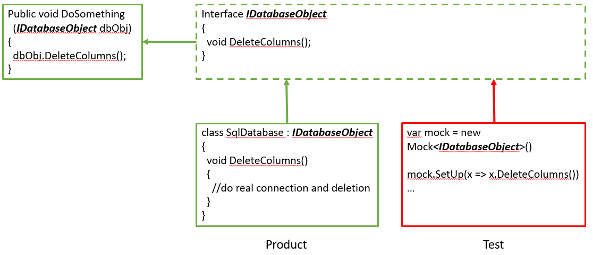

# Dependency Injection

Dependency injection is one form of the broader technique of Inversion Of Control. 
It is a specific form of decoupling software modules.

> Depend upon abstractions. Do not depend upon concrete classes

To unit test a piece of code properly, we would like to isolate it from its dependencies.

Design for Testability:
* Couple Dependencies by Abstractions (interfaces)
* Provide Injections (Parameter-, Contructor-, Property Intection)

