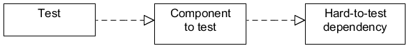
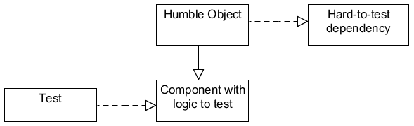

# Humble Object

Make code testable when it is too closely coupled to its environment.
*"Separate behavious that are hard to test from behaviors that are easy to test."*

**Description:**

Extract the logic into a separate easy-to-test component that is decoupled from its environment. 
The environment-dependent humble object has so less logic that it doesnt need to be tested.
For example:
* Visual Components
* Transactional Components
* Asynchronous running components

Bring the logic of these hard-to-instantiate components under test in a cost-effective manner.

**Before:**

**After:**
