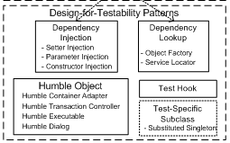

# Testability

Implementation of different Testability Patterns in C#

*(From http://xunitpatterns.com/index.html)*

Todo:
- [x] Subclass To Test
- [x] Humble Object
- [ ] Dependency Injection
- [ ] Interceptor
